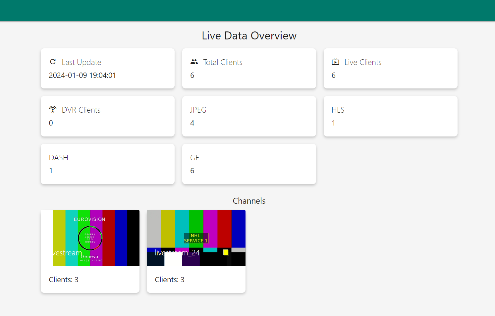
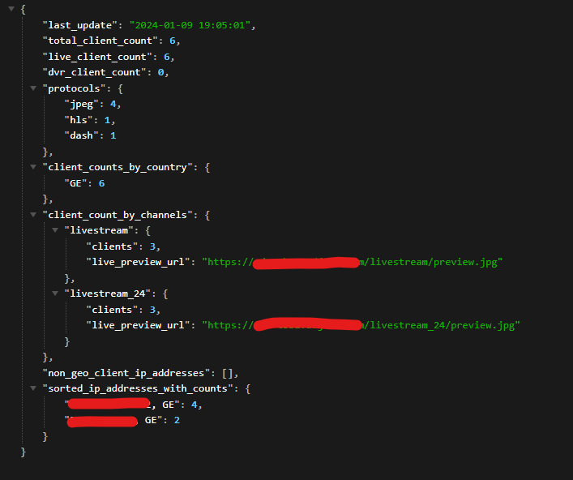

# Flussonic Mediaserver - Data Visualization Dashboard

## Overview
This project is a data visualization dashboard for Adjarabet Arena, designed to display live data overviews including client counts, protocol usage, and channel previews. The backend is built in Python, while the frontend utilizes HTML with Materialize CSS for styling.

## Features
- **Real-time Data Updates:** Live data overview of total, live, and DVR clients.
- **Server Communication:** Backend script to fetch data from multiple servers.
- **Dynamic Content:** Auto-refreshing channel previews and data every minute.
- **Data Breakdown:** Visualization of data by protocol and country.

## Setup and Installation
- **Backend Setup:** 
  - Install Python dependencies: `requests`, `json`, `datetime`.
  - Configure server IPs and credentials in `api.py`.
- **Frontend Setup:** 
  - Host `index.html` on a web server.
  - Ensure JavaScript is enabled for dynamic content loading.

## Installation Requirements
Before running the application, ensure you have the necessary Python dependencies installed. You can install them using pip:
```
pip install requests
pip install json
pip install datetime
```
## Flussonic Media Server Requirements
```
thumbnails; # <-- enable thumbnails for stream
protocols api jpeg; # <-- enable api jpeg for stream
```
## Screenshots

### Web Dashboard

*This screenshot shows the frontend of the application with its real-time data visualizations, dynamic channel previews, and overall layout.*

### Backend API

*This image depicts the backend functionality, showcasing how data is processed and managed in the application.*
